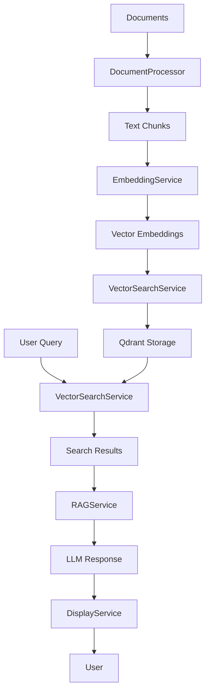

# LocalAI Knowledge Assistant

A comprehensive personal AI knowledge assistant that transforms accumulated digital knowledge into an intelligent, searchable system using local LLM hardware for complete privacy and control.

## 🎯 Project Vision

Build a NotebookLM-style experience that:
- **Processes multiple document types** (PDFs, transcripts, notes) into searchable knowledge
- **Uses local AI models** for complete privacy (no cloud dependencies)
- **Provides RAG-enhanced responses** that synthesize information across sources
- **Maintains source attribution** with page numbers and relevance scores
- **Scales to large knowledge bases** (1000+ documents, multiple GBs)

## 🏗️ Architecture Overview

### Clean Architecture Pattern
```
┌───────────────────┐    ┌───────────────────┐    ┌───────────────────┐
│   Console App     │    │   Core (Domain)   │    │ Infrastructure    │
│  (UI/Entry)       │    │  (Interfaces)     │    │ (Implementation)  │
└───────────────────┘    └───────────────────┘    └───────────────────┘
       │                         │                      │
       │                         │                      │
       ▼                         ▼                      ▼
┌───────────────────┐    ┌───────────────────┐    ┌───────────────────┐
│   Web UI          │    │   Data            │    │ External          │
│  (Blazor)         │    │  (Qdrant, etc.)   │    │ Services          │
└───────────────────┘    └───────────────────┘    └───────────────────┘
```

**Dependencies flow inward**: All outer layers depend on inner layers, not vice versa

### Core Components

#### 🔵 **LocalAI.Core** (Domain Layer)
- **Models**: Data structures (`SearchResult`, `DocumentChunk`, `ChatSession`)
- **Interfaces**: Service contracts that define what the system can do
- **No external dependencies** - pure business logic

#### 🟢 **LocalAI.Infrastructure** (Data Layer)  
- **Service Implementations**: Concrete implementations of Core interfaces
- **External Integrations**: LM Studio, Qdrant, PDF processing
- **Chat Session Storage**: SQLite database for conversation persistence
- **Depends on Core** for interfaces

#### 🔴 **LocalAI.Console** (Presentation Layer)
- **Entry Point**: Dependency injection setup and application lifecycle
- **User Interface**: Interactive console for queries and responses
- **Depends on Core** for interfaces, **uses Infrastructure** implementations

#### 🟡 **LocalAI.Web** (Presentation Layer)
- **Web Interface**: Blazor Server application with Claude-style chat UI
- **API Consumption**: Communicates with LocalAI.Api via HttpClient
- **Conversation Management**: Client-side sessionStorage for temporary history
- **Responsive Design**: Mobile-friendly layout with modern styling
- **Depends on Core** for models, **uses Infrastructure** implementations via API

#### 🟣 **LocalAI.Api** (API Layer)
- **RESTful API**: Exposes document processing and search functionality
- **Swagger Documentation**: Built-in API documentation at `/swagger`
- **Chat Session Management**: CRUD operations for conversations
- **Document Processing API**: Endpoints for processing and uploading documents

## 📡 Service Architecture

### Core Services

| Service | Responsibility | Implementation |
|---------|---------------|----------------|
| **IEmbeddingService** | Generate vector embeddings from text | LM Studio API (`text-embedding-nomic-embed-text-v2-moe`) |
| **IVectorSearchService** | Store and search document vectors | Qdrant vector database |
| **IDocumentProcessor** | Extract and chunk text from files | PDF processing + text chunking |
| **IRAGService** | Generate enhanced responses using LLM | LM Studio chat API with context injection |
| **IDisplayService** | Format and display results to user | Console output with colors and formatting |
| **IChatSessionStore** | Store and manage chat conversations | SQLite database with EF Core |

### Data Flow



## 🚀 Getting Started

### Prerequisites

1. **.NET 8/9 SDK** installed
2. **Docker** for running Qdrant
3. **OpenRouter API Key** (required for default configuration):
   - Sign up at [OpenRouter.ai](https://openrouter.ai/)
   - Copy `.env.example` to `.env` and add your API key
4. **LM Studio** with embedding model loaded (optional, for local embeddings):
   - `text-embedding-nomic-embed-text-v2-moe`

### Setup Steps

1. **Clone and build**:
   ```bash
   git clone <repository-url>
   cd LocalAI-Knowledge
   dotnet build
   ```

2. **Configure API keys**:
   ```bash
   cp .env.example .env
   # Edit .env and add your OpenRouter API key
   ```

3. **Start Qdrant**:
   ```bash
   docker-compose up -d
   ```

4. **Configure LM Studio** (optional, for local embeddings):
   - Start LM Studio server on `localhost:1234`
   - Load embedding model: `text-embedding-nomic-embed-text-v2-moe`
   - Update `appsettings.json` to use local embedding service if preferred

5. **Add documents**:
   ```
   data/
   ├── transcripts/     # .txt files
   ├── pdfs/           # .pdf files
       ├── llms/       # LLM-related PDFs
   ```

6. **Run**:
   ```bash
   cd src/LocalAI.Console
   dotnet run
   ```

### Docker Deployment

The application includes Docker support for easy deployment:

1. **Start infrastructure services**:
   ```bash
   docker-compose -f docker-compose.infrastructure.yml up -d
   ```

2. **Configure environment variables**:
   Make sure your `.env` file is properly configured with your OpenRouter API key:
   ```bash
   cp .env.example .env
   # Edit .env and add your OpenRouter API key
   ```

3. **Start application services**:
   ```bash
   docker-compose up -d
   ```

4. **Access services**:
   - Web UI: http://localhost:7001
   - API: http://localhost:7190
   - Qdrant: http://localhost:6333

**Note**: The default configuration uses OpenRouter for the RAG service. Make sure to set your OpenRouter API key in the environment variables. The docker-compose.yml file is configured to pass through environment variables from your host system to the containers.

## 🔧 Understanding the Code

### Document Processing Pipeline

#### 1. **Text Extraction**
```csharp
// PDF Processing (DocumentProcessor.cs)
using (var doc = PdfDocument.Load(filePath))
{
    // Extract text page by page
    // Track page numbers for attribution
    // Clean up PDF artifacts
}
```

#### 2. **Smart Chunking**
```csharp
// Sentence-aware chunking to preserve context
var chunks = SplitIntoChunks(content, 600, 50);
// 600 chars max, 50 char overlap between chunks
```

#### 3. **Embedding Generation**
```csharp
// Generate vector embeddings via LM Studio
var embedding = await embeddingService.GenerateEmbeddingAsync(text);
// Uses task prefixes: "search_document:" for storage, "search_query:" for queries
```

#### 4. **Vector Storage**
```csharp
// Store in Qdrant with metadata
await vectorSearchService.StoreDocumentsAsync(chunks);
// Includes source, page info, and document type
```

### Search and RAG Pipeline

#### 1. **Semantic Search**
```csharp
// Find relevant documents using vector similarity
var results = await vectorSearchService.SearchAsync(query, limit: 8);
// Returns scored results with source attribution
```

#### 2. **Context Building**
```csharp
// Build context from top search results
var context = BuildRAGContext(query, searchResults);
// Includes source information and relevance scores
```

#### 3. **LLM Response Generation**
```csharp
// Send context + query to local LLM
var response = await ragService.GenerateResponseAsync(query, context);
// Uses chat completion API for synthesized responses
```

## 🔧 Configuration

### appsettings.json Structure
```json
{
  "EmbeddingService": {
    "BaseUrl": "http://localhost:1234",
    "Model": "text-embedding-nomic-embed-text-v2-moe"
  },
  "RAGService": {
    "BaseUrl": "http://localhost:1234", 
    "Model": "qwen/qwen3-coder-30b"
  },
  "Qdrant": {
    "BaseUrl": "http://localhost:6333",
    "CollectionName": "knowledge"
  },
  "DocumentPaths": {
    "Transcripts": "data/transcripts/",
    "PDFs": "data/pdfs/"
  },
  "OpenRouter": {
    "UseOpenRouter": false,
    "ApiKey": "YOUR_API_KEY_HERE",
    "Model": "qwen/qwen3-coder",
    "Endpoint": "https://openrouter.ai/api/v1/chat/completions"
  }
}
```

**Key Configuration Points**:
- **BaseUrl**: Can point to different LM Studio instances or other API-compatible services
- **Models**: Easily swap models by changing the model name
- **Paths**: Configurable document source directories
- **Collection**: Qdrant collection name for vector storage
- **OpenRouter**: Configuration for enhanced code assistant features (requires API key)

### Environment Variables

For security, API keys and sensitive configuration should be stored in environment variables rather than in appsettings.json. 

1. Copy `.env.example` to `.env`:
   ```bash
   cp .env.example .env
   ```

2. Edit `.env` and add your actual API keys:
   ```bash
   OPENROUTER_API_KEY=your_actual_openrouter_api_key_here
   ```

3. The application will automatically load these environment variables at startup.

**Note**: The `.env` file is included in `.gitignore` and will not be committed to version control.

### Local Model Configuration

If you prefer to use local models instead of OpenRouter:

1. Start LM Studio with the required models:
   - Embedding model: `text-embedding-nomic-embed-text-v2-moe`
   - Chat model: `qwen/qwen3-coder-30b`

2. Update `appsettings.json`:
   ```json
   {
     "RAGService": {
       "BaseUrl": "http://localhost:1234",
       "Model": "qwen/qwen3-coder-30b"
     },
     "OpenRouter": {
       "UseOpenRouter": false
     }
   }
   ```

3. Update `.env`:
   ```bash
   OPENROUTER_USE_OPENROUTER=false
   ```

## 🛠️ Development Workflow

### Adding New Document Types

1. **Extend IDocumentProcessor**:
   ```csharp
   Task<List<DocumentChunk>> ProcessMarkdownFileAsync(string filePath);
   ```

2. **Implement in DocumentProcessor**:
   ```csharp
   public async Task<List<DocumentChunk>> ProcessMarkdownFileAsync(string filePath)
   {
       // Parse markdown, preserve structure
       // Generate chunks with appropriate metadata
   }
   ```

3. **Update ProcessAllDocumentsAsync** to include new file type

### Adding New LLM Providers

1. **Create new service** implementing `IRAGService`:
   ```csharp
   public class OllamaRAGService : IRAGService
   {
       // Implement Ollama-specific API calls
       public async Task<string> GenerateResponseAsync(string query, List<SearchResult> searchResults)
       {
           // Implementation here
       }
       
       public async Task<string> GenerateResponseAsync(string query, List<SearchResult> searchResults, List<ConversationExchange> conversationContext)
       {
           // Implementation here with conversation context
       }
   }
   ```

2. **Register in DI container**:
   ```csharp
   services.AddScoped<IRAGService, OllamaRAGService>();
   ```

3. **Update configuration** for new provider settings

### Web UI Development

The Web UI is built with Blazor Server and follows a component-based architecture:

1. **Components** are located in `src/LocalAI.Web/Components/`
2. **Services** for API communication are in `src/LocalAI.Web/Services/`
3. **Models** specific to the Web UI are in `src/LocalAI.Web/Models/`

**Key Components**:
- `SearchPage.razor` - Main chat interface with Claude-style UI
- `Documents.razor` - Document management and processing
- `Dashboard.razor` - System status and metrics

**Styling**:
- Uses Bootstrap 5 for responsive design
- Custom CSS in component-specific style blocks
- Mobile-first responsive design approach

### Testing Approach

#### Unit Testing
```csharp
// Mock services for isolated testing
var mockEmbedding = new Mock<IEmbeddingService>();
var processor = new DocumentProcessor(mockEmbedding.Object, config);
```

#### Integration Testing
```csharp
// Test with real services but controlled data
var testDoc = "test.pdf";
var chunks = await processor.ProcessPdfFileAsync(testDoc);
Assert.True(chunks.Count > 0);
```

## 🐛 Troubleshooting

### Common Issues

**"Collection already exists, skipping processing"**
- Solution: Delete Qdrant collection to force reprocessing
- Command: `curl -X DELETE "http://localhost:6333/collections/knowledge"`

**"LM Studio API failed"**
- Check LM Studio is running on correct port
- Verify embedding model is loaded
- Test with: `curl http://localhost:1234/v1/models`

**"No documents found to process"**
- Verify document paths in appsettings.json
- Check file permissions
- Ensure supported file types (.txt, .pdf)

**Slow processing times**
- Normal for large PDFs (18MB = 20-45 minutes)
- Check GPU utilization in Task Manager
- Consider reducing chunk size for faster processing

### Performance Optimization

**Embedding Generation**:
- Batch multiple embeddings if LM Studio supports it
- Consider parallel processing for multiple files
- Monitor GPU memory usage

**Vector Search**:
- Qdrant is extremely fast (<1ms search time)
- Bottleneck is usually embedding generation, not search
- Increase search limit for better RAG context

## 📊 System Metrics

### Processing Benchmarks
- **Text files**: ~100 chunks/minute
- **PDF files**: ~50-100 chunks/minute (depends on complexity)
- **Embedding generation**: ~200ms per chunk (RTX 5070 Ti)
- **Vector search**: <1ms per query
- **Storage capacity**: 30GB per 1000 processed documents

### Hardware Requirements
- **Minimum**: RTX 3060 Ti, 16GB RAM
- **Recommended**: RTX 4070+, 32GB RAM
- **Optimal**: RTX 5070 Ti+, 64GB RAM
- **Storage**: SSD recommended for fast document processing

## 🗺️ Roadmap

### Phase 1: Foundation ✅
- [x] Clean Architecture implementation
- [x] PDF and text processing
- [x] Local embedding generation
- [x] Vector search with Qdrant
- [x] RAG with local LLM

### Phase 2: Enhanced Intelligence (In Progress)
- [ ] Better chunking strategies (respect document structure)
- [x] Web UI for non-technical users
- [ ] Batch processing optimization
- [ ] Progress bars and better UX

### Phase 3: Advanced Features
- [ ] Google Keep notes integration
- [ ] Reddit saves processing
- [ ] Email newsletter parsing
- [ ] Multi-modal search (images, tables)

### Phase 4: Scale & Intelligence
- [ ] Knowledge graph generation
- [ ] Automated knowledge gap detection
- [ ] Proactive insight generation
- [ ] Cross-reference intelligence

## 🤝 Contributing

### Code Style
- **Clean Architecture**: Maintain dependency direction
- **SOLID Principles**: Single responsibility, dependency injection
- **Async/Await**: Use async patterns for I/O operations
- **Error Handling**: Comprehensive exception management
- **Configuration**: Externalize all settings

### Pull Request Process
1. **Branch**: Create feature branch from `main`
2. **Test**: Ensure all functionality works end-to-end
3. **Document**: Update README for new features
4. **Review**: Submit PR with clear description

### Architecture Decisions
When adding new features, consider:
- **Interface First**: Define interface in Core, implement in Infrastructure
- **Configuration**: Add settings to appsettings.json
- **Error Handling**: Graceful degradation and user feedback
- **Performance**: Profile impact on processing times
- **Testing**: How will this be unit/integration tested?